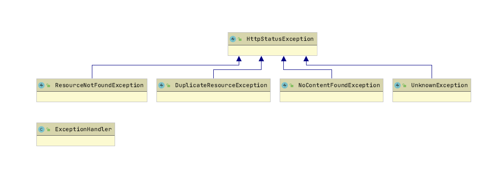

# Getting Started

## An efficient method of exception handling in a Springboot Microservice
This sample Springboot Microservice project demonstrates an objected oriented approach to define
and handle exceptions efficiently with few lines of code. Using this approach would reduce the source code by 100s of 
lines as compared to a typical exception handling method used in a service.
#### Benefits
- Less code
- Less test cases and code coverage.
- Single class to manage the exception handling code.
- Reduced avenues for defects.
- Single point for logging the exceptions.

### A Typical Exception Handling Method
A typical exception handling scenario in a controller based service/microservice is that, gnerally, in every
service endpoint we do the following,
- Either define a separate catch for every exception or an overloaded catch
with common exceptions like catch(Exception1 | Exception2)
- Catch unhandled exception separately.
- Log every exception separately.

For example:
```java
  @DeleteMapping(value = "/employee", consumes = MediaType.APPLICATION_JSON_VALUE)
      public ResponseEntity<Boolean> deleteEmployee(@RequestBody EmployeeDto employeeDto){
          try{
              return new ResponseEntity<>(employeeService.deleteEmployee(employeeDto), HttpStatus.OK);
          }
          catch(ResourceNotFoundException exception){
              //Log Exception
              //Prepare Exception Http Status
              //Prepare Error Message.
              return new ResponseEntity<>(false, HttpStatus.NOT_FOUND);
          }
          catch (Exception exception){
              //Log Exception
              //Prepare Exception Http Status
              //Prepare Error Message.
              return new ResponseEntity<>(false, HttpStatus.INTERNAL_SERVER_ERROR); 
          }
      }
```
 
### Object Oriented Approach using Spring Exception Handler and ControllerAdvice 
- Define an ErrorDto to hold the ErrorCode, ErrorMessage, and HttpStatus
- ErrorCode can be used to localize the exception at client side. 
- Define a generalized base class holding the ErrorDto and extending the runtime exception.
- Define specialized exceptions extending the base exception.
- Define an exception handler class extending the Spring ExceptionHandler class.
- Annotate the exception handler as ControllerAdvice.
- Do not handle any exception in the controller functions.
- Handle only the general and unhandled exception in the exception handler class.
- Throw specialized/specific exceptions from the business or data access layer.

#### Class Diagram



For example:
```java
 @GetMapping(value = "/employee/{id}", consumes = MediaType.APPLICATION_JSON_VALUE)
    public ResponseEntity<EmployeeDto> findEmployee(@PathVariable(value = "id") String id){
        return ResponseEntity.ok(employeeService.findEmployee(id));
    }

@Order(Ordered.HIGHEST_PRECEDENCE)
@RestControllerAdvice
public class ExceptionHandler extends ResponseEntityExceptionHandler {

    @org.springframework.web.bind.annotation.ExceptionHandler(HttpStatusException.class)
    public ResponseEntity<ErrorDto> httpStatusException(HttpStatusException exception){
        //Log Exception
        return new ResponseEntity<>(exception.getError(), exception.getError().getHttpStatus());
    }

    @org.springframework.web.bind.annotation.ExceptionHandler(Exception.class)
    public ResponseEntity<ErrorDto> unknownException(Exception exception){
        //Log Exception
        UnknownException unknownException = new UnknownException(exception.getMessage());
        return new ResponseEntity<>(unknownException.getError(), unknownException.getError().getHttpStatus());
    }

}
```` 

#### Building the service
mvn clean package.

#### Running the service
java -jar demo-0.0.1-SNAPSHOT.jar

Or

Run the application from an IDE like eclipse or Intellij

#### Testing the service
```shell script
curl http://localhost:8080/api/exceptionsdemo/employee/123
{"errorCode":"123","errorMessage":"Resource: (Employee) with id: (123) was not found ","httpStatus":"NOT_FOUND"}

curl --header "Content-Type: application/json"   --request POST   --data '{"id":"123","name":"xyz"}'   http://localhost:8080/api/exceptionsdemo/employee
{"errorCode":"456","errorMessage":"Resource: (Employee) with value: (xyz) already exists ","httpStatus":"BAD_REQUEST"}

curl --header "Content-Type: application/json"   --request PUT   --data '{"id":"123","name":"xyz"}'   http://localhost:8080/api/exceptionsdemo/employee
{"errorCode":"112233","errorMessage":"Unknown error occurred: Runtime Error","httpStatus":"INTERNAL_SERVER_ERROR"}

```
